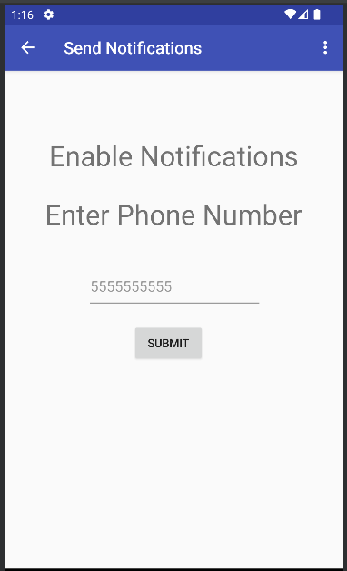

<h1 align="center">SNHU CS 360:  Mobile Architecture & Programming</h1>
<h2 align="center">Project Details</h2>
<b>Competency</b>
<ul>
  <li>Develop and launch a fully functional mobile application</li>
</ul>
<b>Scenario</b>
 
Your app UI design has been received positively by the client, which means you are now ready to proceed to the final stages of the development process. The client is eager to see the completed product ready for launch. To make this happen, you know that most of your time will need to be spent creating functional, error-free code that will run the app.
 
 
However, you also know there are further steps that must be completed after the coding in order for the app to be made widely available. To support your client with this part of the process, you will need to create a recommended launch plan that details how to successfully reach the client’s intended users.
 
<b>Requirements</b>
<ul>
  <li><b>Develop code that allows a user to log in. </b>The app should check the username and password against the database when the user attempts to log in.  If the user has never logged into the application before, the user should be able to create a new login and password. The application needs to save these to a table in the database.</li>
  <li><b>Develop code to create a database shell and display that database’s information on a user’s screen using a grid.</b> Create: The user should be able to add items to a database.  Delete: The user should be able to remove items from a database.  Update: The user should be able to change the value associated with individual database items (e.g. the number of a specific item in an inventory or the date of an event).  Read: The user should be able to view all of the database items displayed as a grid.</li>
  <li><b>Develop code that prompts users for permission to send SMS messaging notifications and makes the app function based on the individual user's response.</b> If the user grants permissions, the application should send alerts to the user as SMS messages. The alerts correspond to the specific notification trigger of the application you chose (low inventory, an upcoming event, or reaching a goal weight).  If the user denies permission, then the rest of the application should still continue to function without the SMS messaging notification feature.</li>
</ul>
<b>Software Used</b>
<ul>
<li>Android Studio</li>
</ul>
<b>Usage</b>
<table>
<tr>
<th>Landing / Login Page</th>
<th>Track Page</th>
</tr>
<tr>
<th></th>
<th></th>
</tr>
<tr>
<th>New Weight Dialog Box</th>
<th>New Weight Added</th>
</tr>
<tr>
<th></th>
<th></th>
</tr>
<tr>
<th>Delete and Edit Screen</th>
<th>Send SMS Screen</th>
</tr>
<tr>
<th></th>
<th></th>
</tr>
</table>
<h2 align="center">Project Reflection</h2>
<b>How did you approach the process of coding your app? What techniques or strategies did you use? How could those be applied in the future?</b>
 
I collected requirements and worked on one feature at a time.  Certain features, such as saving the user information for login, were helping for other aspects such as saving the daily weights.  This is helpful with breaking up larger projects into smaller pieces so it doesn't feel as insurmountable.  I wish I would have developed the app one page a week in an interative fashion, so that it would not have been so intensive at the end.
 
 
<b>How did you test to ensure your code was functional? Why is this process important and what did it reveal?</b>
 
I used an android emulator and originally hardcoded data such as daily weights to ensure the app had the required functionality.  This was important because I utilized a RecyclerView which can only be created if there is data to populate it.
 
 
<b>Considering the full app design and development process, from initial planning to finalization, where did you have to innovate to overcome a challenge?</b>
 
I have challenges with the UX/UI side of things.  I don't feel like that is my strong suit and creating graphics is not something I am strong with.  To work beyond that, I wanted to ensure that the app was clean, functional, and exceeded the user's expectations.
 
 
<b>In what specific component from your mobile app were you particularly successful in demonstrating your knowledge, skills, and experience?</b>
 
I was very proud of myself with implementing a RecyclerView.  I found it to be the cleanest, most efficient, and easiest to customize as the data changes while not having to change an entire screen.